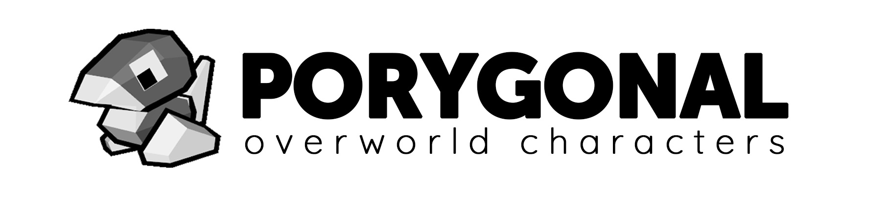

# Porygonal - Overworld Characters

**Porygonal - Overworld Characters** replaces Pokémon Generation I overworld character sprites with custom 3D models while preserving the original game's movement, map logic, and gameplay.

It is designed for **Gen1Recomp / Gen1Recomp++** and integrates with supported 3D renderer mods through dedicated compatibility adapters.

## Features

Porygonal replaces supported overworld character visuals with 3D models, including:

- the player;
- NPCs;
- bicycle states;
- Surf states;
- Fishing states;
- Fly animations;
- selected renderer-authored characters and figures.

The original game remains responsible for gameplay and actor state. Porygonal replaces their visual representation.

## Supported games

Porygonal - Overworld Characters targets Generation I:

- Pokémon Red
- Pokémon Blue
- Pokémon Yellow

A legally obtained compatible game ROM is required by Gen1Recomp.

**Porygonal does not include any ROM or game data.**

## Supported 3D renderers

Porygonal uses renderer-specific compatibility adapters.

Currently supported:

- **Dramatic Shape**
- **Dramaless Shape**
- **PotatoVoxel**

Only **one supported 3D renderer should be enabled at a time**.

If no supported renderer is detected, Porygonal cannot initialize its 3D character integration.

If multiple supported renderers are detected simultaneously, Porygonal intentionally avoids selecting one arbitrarily.

## Installation

### 1. Install Gen1Recomp / Gen1Recomp++

Install and configure Gen1Recomp, then import your legally obtained Pokémon Red, Blue, or Yellow ROM.

### 2. Install a supported 3D renderer

Install and enable one of the supported renderers:

- Dramatic Shape
- Dramaless Shape
- PotatoVoxel

Only enable one supported renderer at a time.

### 3. Install Porygonal

Download the release ZIP for **Porygonal - Overworld Characters**.

In the Gen1Recomp launcher:

1. Open **MODS**.
2. Select **Import mod .zip**.
3. Select the Porygonal release ZIP.
4. Enable **Porygonal - Overworld Characters** for your game.

### 4. Start the game

Launch Pokémon Red, Blue, or Yellow normally.

Porygonal will detect the active supported renderer and initialize the corresponding character adapter.

## Manual installation

For development or manual installation, place the complete Porygonal mod folder inside a Gen1Recomp `mods/` directory.

The folder containing these files must be the root of the installed mod:

```text
Porygonal_Overworld_Characters/
├── manifest.json
├── main.lua
├── character_registry.lua
├── character_runtime.lua
├── character_tuning.lua
├── game_version_profile.lua
├── assets/
├── palettes/
└── renderers/
```

Do not place the mod inside an additional nested folder.

## Troubleshooting

### Porygonal is enabled, but characters are still 2D

Check that:

- a supported 3D renderer is installed;
- the renderer is enabled;
- only one supported renderer is active;
- Porygonal is enabled for the current game;
- `manifest.json` and `main.lua` are located at the root of the installed mod.

### A specific animation or character is incorrect

Some renderer features use independent rendering paths.

When reporting a compatibility issue, please include:

- renderer name and version;
- Pokémon version;
- map or location;
- affected character or action;
- whether the issue concerns the model, shadow, or an original 2D effect;
- for renderers using geometry caches, whether the issue occurs after a cache rebuild or PREBUILD.

Useful examples include:

- walking or idle;
- bicycle;
- Surf;
- Fishing;
- Fly departure or landing;
- Pokémon Center characters;
- renderer reflections or special camera modes.

## Project structure

```text
Porygonal_Overworld_Characters/
├── manifest.json
├── main.lua
├── game_version_profile.lua
├── character_registry.lua
├── character_tuning.lua
├── character_runtime.lua
│
├── assets/
│   ├── grayscale_palette.png
│   └── porygonal_characters.pak
│
├── palettes/
│
└── renderers/
    ├── renderer_manager.lua
    ├── dramatic_shape/
    ├── dramaless_shape/
    └── potato_voxel/
```

### Core

The core identifies characters, selects assets, resolves palettes, and provides renderer-independent character data.

### Renderer adapters

Each supported renderer has its own compatibility adapter.

This separation allows Porygonal to support different rendering architectures without placing renderer-specific behavior inside the character registry or asset system.

## Character assets

Production 3D character meshes are distributed through the Porygonal packaged asset container.

Assets are loaded and cached by the runtime so decoding and decompression are not performed every frame.

## Renderer compatibility

Renderer compatibility is developed conservatively.

Adapters are designed to:

- preserve the renderer's normal scene behavior;
- avoid additional game pose evaluations;
- replace visible characters and shadows through the renderer's real draw paths;
- handle special states such as Fishing and Fly independently;
- support renderer-authored map figures where required;
- avoid affecting unrelated renderer geometry or effects.

## Development

Renderer integration documentation is maintained alongside the renderer adapters in the source project.

Each renderer folder documents its own compatibility requirements and special cases.

## Contributing

Renderer compatibility is the main extension point of Porygonal.

When adding or updating renderer support:

1. keep renderer-specific code inside its renderer folder;
2. preserve the renderer-independent character and asset contracts;
3. test ordinary characters and shadows first;
4. test bicycle, Surf, Fishing, and Fly independently;
5. test renderer-authored characters where applicable;
6. test multiple maps and special rendering passes;
7. test both fresh and prebuilt renderer caches when the renderer uses them.

Compatibility changes should be tested against the exact renderer version they target.

## Third-party projects

Porygonal interoperates with Gen1Recomp and third-party renderer mods.

Those projects remain independent projects with their own authors, repositories, assets, and license terms.

Porygonal does not redistribute Pokémon ROM data.


## License

Porygonal source code is licensed under the **GNU General Public License v3.0 (GPL-3.0)**. See `LICENSE`.

The GPL-3.0 license applies to the source code only. Original Porygonal 3D assets are not distributed under an open-source license.

Third-party renderers are separate projects and are not redistributed by Porygonal. Their own licenses and terms apply.
